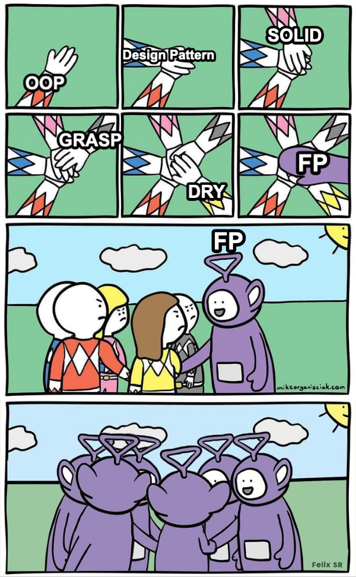

# Hi 👋, I'm FizzyElt

## Functional Programmer

  

- 🌱 I’m currently learning **Rust, Lean 4, OCaml, Functional Programming, Category theory**

- 📫 How to reach me **fizzyelt.dev@outlook.com**

- [My blogs](https://fizzyelt.com/)

### Languages

- Javascript / Typescript
- OCaml
- Rust
- Lean
- Haskell (a little)
- HTML / CSS

### Tools

- React
- Chakra UI
- Effect-ts
- tailwind css
- git
- node.js
- fp-ts

&nbsp;

&nbsp;

